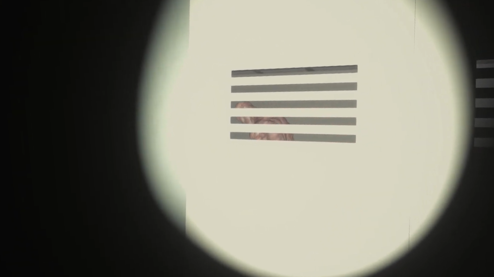
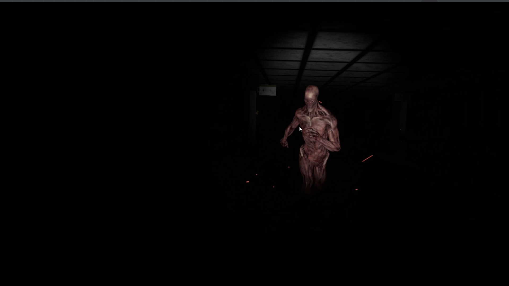
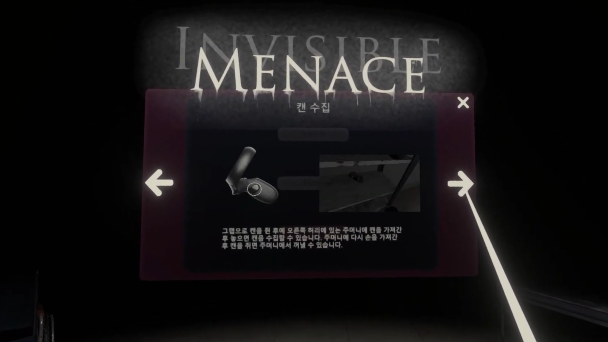
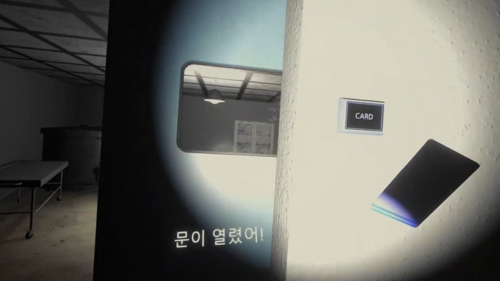
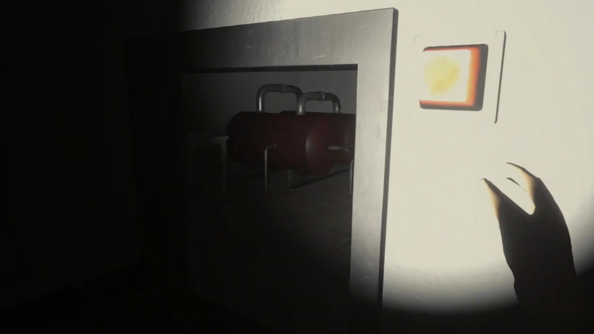

# Invisible Menace

## 👉Summary

**[Game title : Invisible Menace]**  
**[Genre : VR Horror Action Adventure Game]**  
**[Tools : Unity 3D, XR Interaction Toolkit]**  
**[Purpose : Developing VR game using Unity XR Toolkit]**  
**[Period : Nov.2020 - May.2021]**  
**[Head count : 1]**  
**[Task : Game design, Game system implementation]**  

## 👉Implementations

* ✔ Player Control: I implemented player movement and collision in VR using XR Rig and Character Controller provided by the XR Interaction Toolkit and the Unity engine.
  * Code Location: https://github.com/yoonsangmin/GraduationProject/tree/main/Assets/Scripts/Player/VR  

* ✔ VR Interaction System: I implemented VR interactions and item change system working with VR controllers using XR Direct Interactor.
  * Code Location: https://github.com/yoonsangmin/GraduationProject/tree/main/Assets/Scripts/Items  

* ✔ Enemy AI FSM: I implemented enemy FSM using StateMachineBehaviour provided by the Unity Animator. When player receives light near an enemy or moves quickly, the enemy can detect player.
  * Code Location: https://github.com/yoonsangmin/GraduationProject/tree/main/Assets/Scripts/Enemy  

* ✔ Can Throwing: I implemented the function to throw cans to attract enemy attention and inventory system to store cans.
  * Code Location: https://github.com/yoonsangmin/GraduationProject/tree/main/Assets/Scripts/Items/Can  

* ✔ VR UI: I implemented VR UI interaction working with VR controllers using XR Ray Interactor.
  * Code Location: https://github.com/yoonsangmin/GraduationProject/tree/main/Assets/Scripts/UI  

* ✔ Caption System: I implemented captioning and pop-up system using box collider triggers and player collision events.
  * Code Location: https://github.com/yoonsangmin/GraduationProject/tree/main/Assets/Scripts/Caption  

## 👉Game Screenshots

## 👉Game Video

- **Youtube : [https://www.youtube.com/playlist?list=PLjSAhx-L2n8eJ2KvOXnYzs_RqY81yp7-q](https://www.youtube.com/playlist?list=PLjSAhx-L2n8eJ2KvOXnYzs_RqY81yp7-q)**

### After cloning, you need to download the file managed by lfs.
`git lfs pull`
